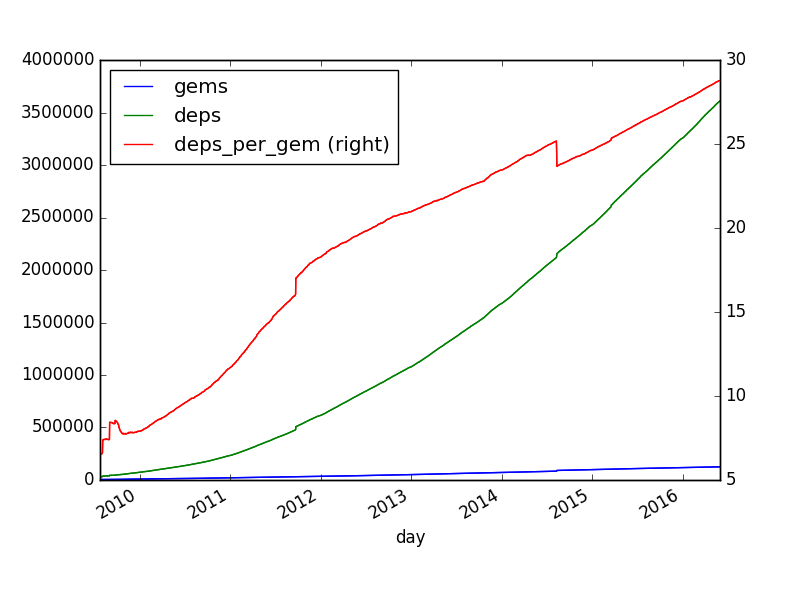

# About

This is work in progress, containing scripts to generate statistics over Ruby gems in form of a Jupyter notebook.

It's for comparing against the [development of Node modules](http://www.apiful.io/intro/2016/06/01/npm-analysis.html).

Also see the [tweets about this](http://www.apiful.io/intro/2016/06/01/npm-analysis.html).

## Some pictures :)

